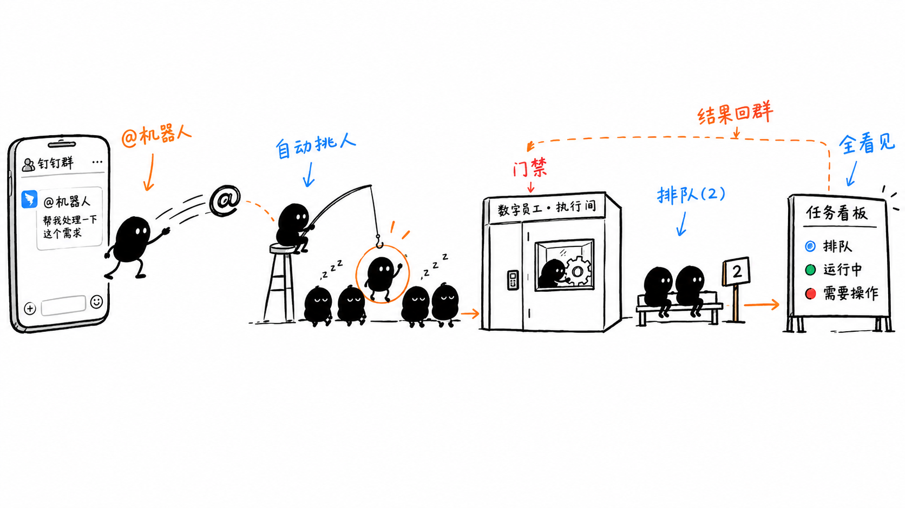
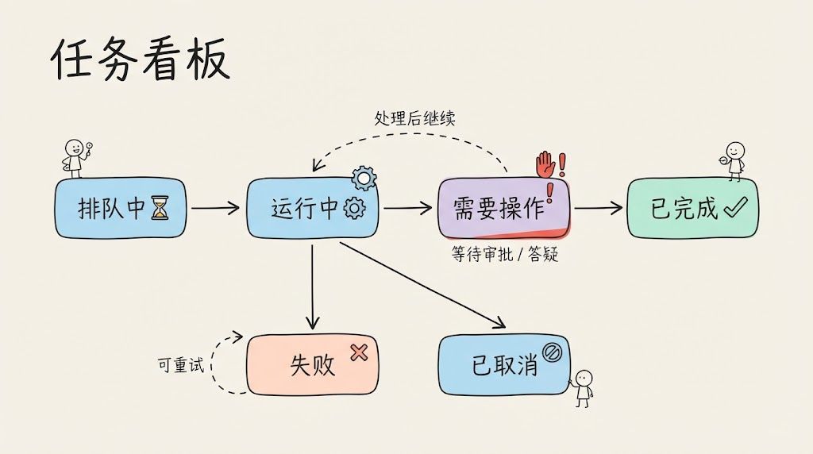

#  dsh-waker

把IM变成 DSH 数字员工的唤醒入口：在群里 @机器人 说一句需求，任务就自动执行并把结果发回群里。



## 功能

- **@机器人 即派活**：群聊 @机器人（或单聊直接发），消息自动交给 DSH 执行，结果自动回IM
- **多角色 Waker**：可创建多个不同职能的数字员工（如全栈开发、测试），发消息时自动匹配最合适的一个
- **项目隔离**：每个 Waker 只能访问授权给它的项目，越权写入被沙箱拒绝
- **任务看板**：排队中 / 运行中 / 需要操作 / 失败 / 已取消 / 已完成，可筛选、取消、重试
- **排队与并发**：同时最多跑 N 个任务（默认 2），超限自动排队



## 解决什么问题

- **人必须在电脑前盯会话**：现在IM发条消息就能远程派活，手机上也能用
- **执行过程是黑盒**：任务看板实时展示状态，等待审批时标记「需要操作」，点进去就能处理
- **任务执行到一半卡在提问上**：Waker 有疑问时会把问题转到IM群里，你回复后它继续跑
- **对话上下文混乱**：同一群每天一个会话窗口，上下文延续；发「新任务： <内容>」强制开新任务

## 怎么使用

### 1. 创建IM机器人（一次性）

1. 登录 [IM开放平台](https://open-dev.dingtalk.com/) → 应用开发 → 创建企业内部应用
2. 应用能力 → 添加「机器人」能力，接收消息模式选 **Stream 模式**（无需公网）
3. 应用凭证页拿到 **Client ID（AppKey）** 和 **Client Secret（AppSecret）**，发布应用版本
4. 把机器人拉进群聊（或直接单聊）

### 2. 安装插件

```bash
dsh plugin --profile web add github:sflyq/dsh-waker#v0.1.0
```

若提示 `blocked build`，把 CLI 打印的键加进 `~/.dsh/profiles/web/pnpm-workspace.yaml` 后重跑：

```yaml
allowBuilds:
  dsh-waker: true
```

然后重启 `dsh web` 并强刷浏览器（⌘⇧R）。npm 包发布后也可用 `dsh plugin --profile web add dsh-waker`。

### 3. 配置并使用

1. DSH 设置 → Waker → IM 管理：填入 Client ID 和 Client Secret →「保存并应用」，状态变「已连接」
2. DSH 设置 → Waker：配置 Waker（职能、头像）、项目（本地路径或 Git 仓库）、@Waker 绑定
3. 群里 @机器人 + 任务描述，例如：

> @机器人 帮我看看当前仓库的结构

- 机器人秒回「收到了」，随后按任务类型执行，完成后回执结果
- 追问直接继续 @，上下文延续；`新任务： <内容>` 强制新建
- 群聊没 @ 机器人时完全静默，不会打扰

更多安装方式（npm 包 / 源码 / 插件市场）见 [ARCHITECTURE.md](ARCHITECTURE.md)。

## 已知限制

- 任务「已完成」只代表运行结束，产物需人工检查
- 长任务超时（默认 30 分钟）仅提醒，不自动终止
- 单机单用户设计；多群共享同一并发池

架构与开发细节见 [ARCHITECTURE.md](ARCHITECTURE.md)。
